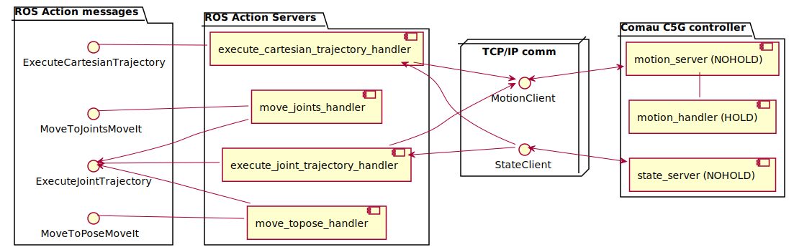

# comau_action_handlers

Here is a component diagram of the comau action servers



## Prerequisites

The asynchronous action servers require **no controller running** on the hardware interface, except the **joint_state_controller**. This is the **default** state of the hardware interface.

To check if the asynchronous feature is enabled

```bash
rostopic echo /async_enable # If true no "write" controller is running
rostopic echo /robot_status # The status of the robot
```

**If the robot is in a ready state and the async_enable topic is true, the action servers will send the goal for execution on the real robot otherwise they will abort.**

**If sensor tracking controller is running disable it with a service call to the controller manager**

```bash
rosservice call /controller_manager/switch_controller "
start_controllers: []
stop_controllers: ['sensor_tracking_controller']
strictness: 2
start_asap: false
timeout: 0.1" 
```


**ATTENTION!!!**\
Always check the robot surroundings. Make sure that no one is near the robot.

## Send a asynchronous trajectory execution command

Start the `motion_handler` PDL program.

Now you are ready to send a trajectory from an ROS action client to execute joint / cartesian trajectory  action server. You may find the definition of this ROS action at `comau_msgs` package.

For simple tests you can use the test [GUI action client](https://github.com/ros/actionlib/tree/noetic-devel/actionlib_tools) with the following command:

```bash
rosrun actionlib axclient.py /execute_joint_trajectory_handler
rosrun actionlib axclient.py /execute_cartesian_trajectory_handler
```
### Joint trajectory

At the *Goal* area of the window you should place a trajectory of multiple joint positions. For valid goals, you should follow the format of the example bellow :

```yaml
trajectory: [
positions: [0.436332, 0.0, -1.5708, 0.0, 0.0, 0.0],
positions: [0.872665, 0.0, -1.5708, 0.0, 0.0, 0.0],
positions: [1.22173, 0.0, -1.5708, 0.0, 0.0, 0.0],
#
# other joint positions with angles in rad
#
positions: [0.872665, 0.0, -1.0472, 0.0, 0.0, 0.0]
]
```

### Cartesian trajectory

At the *Goal* area of the window you should place a trajectory of multiple cartesian poses. For valid goals, you should follow the format of the example bellow :

```yaml
trajectory: [
# relative to tool frame 
{header: {frame_id: tool_controller}, x: 0.0, y: 0.0, z: 0.1, roll: 0.0, pitch: 0.0, yaw: 0.0},
# relative to base link
{header: {frame_id: base_link}, x: 0.9339, y: 0.0, z: 1.1506, roll: 0.0, pitch: 1.5707, yaw: 0.0},
#
# other cartesian poses with angles in rad
#
{header: {frame_id: base_link}, x: 0.9339, y: 0.0, z: 1.1506, roll: 0.0, pitch: 1.5707, yaw: 0.0}
]
```

trajectory: [{header: {frame_id: base_link}, x: 0.515, y: -0.2, z: 0.784, roll: 0.0, pitch: 1.57, yaw: 0.0}]

When you click send goal the robot should start to move along the trajectory that you have send.


## Use MoveIt with Comau robots
Currently there are 2 Action Servers implement for interfacing Comau Robots with MoveIt

1. **MoveToPose** : This Action Server takes as a goal a target position for the robot to go to. With **frame_id** parameter you change the frame this goal is calculated relative from.

2. **MoveJoints** : This Action Server takes as a goal desired joint position for the robot to go to.

**On the Goal definition of these Action Servers there is a bool argument send_trajectory that if set to true will do the MoveIt planning and send the calculated trajectory as a goal to the execute_joint_trajectory_handler Action server for execution on the real robot or on the Roboshop**

**If this parameter is set to false will execute the trajectory dynamically - currently implemented only on simulation.**

Start the `motion_handler` PDL program.

```bash
# launch the moveit action server
roslaunch comau_action_handlers main_comau_action_handlers.launch
rosrun actionlib axclient.py /move_topose_handler_server/action
rosrun actionlib axclient.py /move_joints_handler_server/action
```
### MoveIt Joint Goal

At the *Goal* area of the window you should place the joint position goal. For valid goals, you should follow the format of the example bellow :

```yaml
# Move Joints
send_trajectory: True
joints: [{name: joint_1, value: 0.0},
        {name: joint_2, value: 0.0},
        {name: joint_3, value: -1.5707},
        {name: joint_4, value: 0.0},
        {name: joint_5, value: 0.0},
        {name: joint_6, value: 0.0}]
endEffectorVelocity: 0.1
endEffectorAcceleration: 0.1
timeoutSeconds: 10.0
```

### MoveIt Pose goal

At the *Goal* area of the window you should place the cartesian position goal. With **frame_id** parameter you change the frame this goal is calculated relative from. For valid goals, you should follow the format of the example bellow :

```yaml
# Move To Pose
send_trajectory: True
constraint_mode: 0
target_pose: {header: {frame_id: tool_controller}, pose: {position: {x: 0.0, y: 0.0, z: 0.1}, orientation: {x: 0.0, y: 0.0, z: 0.0, w: 1.0}}}
velocity: 0.1
acceleration: 0.1
timeout: 20.0
```
