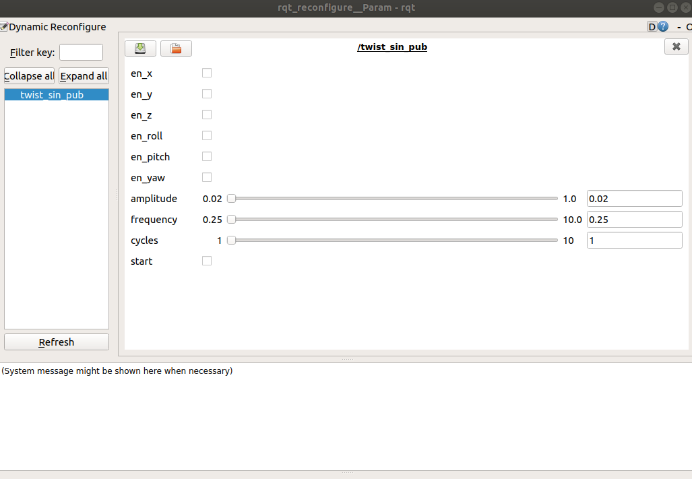
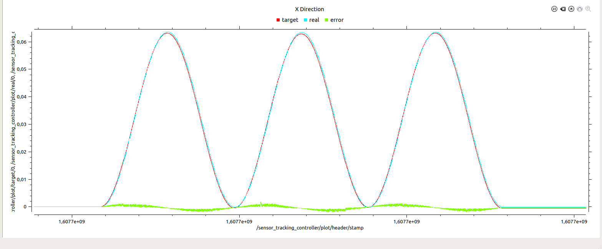

# Sensor Tracking

**ATTENTION!!!**\
Always check the robot surroundings. Make sure that no one is near the robot.

### Robot side

Clone the comau_pdl_ws in the PC that has access to robot's controller FTP. 

```bash
git clone https://github.com/LMS-Robotics-VR/comau_pdl_ws.git
```

1. Load `pdl_tcp_functions`. (NO HOLD PDL program with utility functions for the TCP/IP communication)
2. Load `state_server`. (NO HOLD PDL program that contains a TCP server for publishing robot's state)
3. Load `motion_server`. (NO HOLD PDL program that contains a TCP server for receiving motion commands)
4. Load `motion_handler`. (HOLD PDL program that executes the motion commands)

### PC side

## Prerequisites

The Sensor Tracking feature requires the **sensor_tracking_controller** to be running. 

In the default state it is not

**Sensor tracking can be enabled with a service call to the controller manager**

**To Start it**

```bash
rosservice call /controller_manager/switch_controller "
start_controllers: ['sensor_tracking_controller']
stop_controllers: []
strictness: 2
start_asap: false
timeout: 0.1" 
```

**To Stop it**

```bash
rosservice call /controller_manager/switch_controller "
start_controllers: []
stop_controllers: ['sensor_tracking_controller']
strictness: 2
start_asap: false
timeout: 0.1" 
```

### Starting Sequence

1. Ensure that you have connection with the robot or RoboShop.
2. Start the `motion_handler` PDL program.


## How to Use Sensor Tracking Functionality

The custom cartesian controller responsible for sensor tracking expects a geometry_msgs/TwistStamped message in the /arm_cmd_vel topic. Then it will transform the velocity message into cartesian correction based on the control loop frequency of the hardware interface and send the command to the robot controller

For that a teleop node was implemented (make sure it has executable permissions 

`roscd comau_controllers/scripts && chmod +x arm_teleop`

### How to use teleop node

```bash
# To start the teleop node
rosrun comau_controllers arm_teleop
```

q, w, e, r, t, y -> +lin.x, +lin.y, +lin.z, +ang.x, +ang.y, +ang.z respectively

a, s, d, f, g, h -> -lin.x, -lin.y, -lin.z, -ang.x, -ang.y, -ang.z respectively

i : increase speed, k : decrease speed, l : stop movement

**ATTENTION!!!**

If you press for example **q** and let go the robot will keep moving. You need to press **l** button to **stop** the movement. Furthermore only one button will be taken into consideration at a time.

# How to Plot Data of Sensor Tracking

## Overview

On the sensor tracking custom controller a real time **plot** publisher was implement, which publishes on the **/sensor_tracking_controller/plot** topic data useful for contructing the plots. To enable it on the **comau_driver/config/controllers.yaml** file enable the with_plot parameter (default is true)

```bash
# Controller for sensor tracking
sensor_tracking_controller:
   type: comau_controllers/SensorTrackingController
   joints: *robot_joints
   dead_man_timeout: 0.2
   ee_vel_limit: 0.2
   with_plot: true
   stop_trajectory_duration: 0.5
   state_publish_rate: 25
   action_monitor_rate: 20
```

This controller will store the first position of the robot's tool frame, which is necessary for the plots to be relative and not have a constant error.

The controller receives a TwistStamped message on the topic **/arm_cmd_vel**. Then it will transform the velocity message into cartesian correction based on the control loop frequency of the hardware interface and send the command to the robot controller

### Plot Data

1. The target field is the **running sum** of these corrections
2. The real field is the position of the end effector (minus the starting position). This position is acquired through a tf listener
3. The error field is the difference between the two

All these fields are arrays of size 6 corresponding to x, y, z, roll, pitch, yaw corrections respectively **Sometimes the transformation from Quaternion to euler has weird behaviour which might be translated to the plots for roll, pitch, yaw**

## How to send Twist message

**First** call this service, when the robot is stationary, to reset the plot data based on the end effectors position (**The first time this is not necessary**)

```bash
rosservice call /reset_plot_data "reset: true"
```

For easily sending Twist messages to the robot a dynamic reconfigurable node/twist publisher was implemented.

To start it

```bash
roslaunch comau_tools twist_pub.launch
```

You should see this window



1. With **en_x, en_y, en_z, en_roll, en_pitch, en_yaw options**, you can chose at which directions you want to send sin waves at the same time.
2. **amplitude** is the amplitude of the sin wave
3. **frequency** is the frequency of the sine wave (if frequency is set to 0, the twist will be equal to amplitude for 4*cycles seconds)
4. **cycles** how many cycles of the sine wave to publish
5. **start** when you check start, the publisher will start publish the twist message on the robot

**Ofcourse you can use the teleop node instead or other options**

**If you want to record the data for post processing or post plotting you can use rosbags**

```bash
rosbag record -a #before sending the sin twist
 rosbag play  <name>.bag # for playing back the data
```

## How to plot the data

```bash
roslaunch comau_tools multi_plot.launch
```

With the above launch file 6 **rqt_multiplot** windows will appear, each for each direction.



**Make sure the plots are running and not paused (default paused)**

Run the plots you need, close the others.

After that you can publish the twist message to the robot and see the plot real time, or playback the bag file.

**if you send a twist sin wave and want to send another reset the position first**

```bash
rosservice call /reset_plot_data "reset: true"
```
