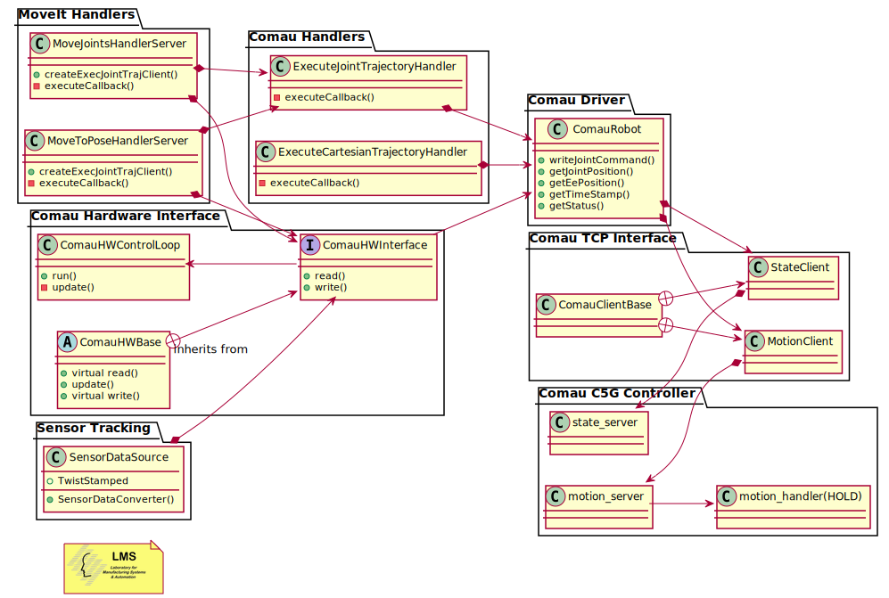

# comau_driver 

# Overview of the comau ros driver

## Prelogue

This Driver currently offers two implementations 

1. Send Asynchronously precalculated joint or cartesian trajectories through action servers    

2. Sensor Tracking synchronous interface through a custom effort controller 

Below you can see a component diagram of the classes related to the driver




# How to control a real robot 

**ATTENTION!!!**\
Always check the robot surroundings. Make sure that no one is near the robot.

# Robot side

Clone the comau_pdl_ws in the PC that has access to robot's controller FTP.

```bash
git clone https://github.com/LMS-Robotics-VR/comau_pdl_ws.git
```

1. Load `pdl_tcp_functions`. (NO HOLD PDL program with utility functions for the TCP/IP communication)
2. Load `state_server`. (NO HOLD PDL program that contains a TCP server for publishing robot's state)
3. Load `motion_server`. (NO HOLD PDL program that contains a TCP server for receiving motion commands)
4. Load `motion_handler`. (HOLD PDL program that executes the motion commands)

# PC side

## Configuration

At **comau_driver/config/controllers.yaml** we can find the configuration parameters of the hardware interface, the control loop and of the controllers.

```bash
# Settings for ros_control control loop
comau_hardware_control_loop:
  loop_hz: &loop_hz 500
  cycle_time_error_threshold: 0.01

# Settings for ros_control hardware interface
comau_hardware_interface:
   use_state_server: true  # Read / Visualize the state of the robot 
   use_motion_server: true # Write to the robot

# Controller for sensor tracking
sensor_tracking_controller:
   type: comau_controllers/SensorTrackingController
   joints: *robot_joints
   dead_man_timeout: 0.2
   ee_vel_limit: 0.2 
```

## Starting Sequence

1. Ensure that you have connection with the robot or RoboShop.
2. Once the ROS workspace is built (see instructions in main [README](../README.md)), you are good to go ahead starting the driver with the following commands in different terminals.

```bash
# To start the comau driver
roslaunch comau_bringup <robot_model>_bringup.launch \
  robot_net_config_file:=<robot_net_config_file>

# To view the robot in RViz
roslaunch comau_viz rviz.launch config:=moveit

```

For the parameter `robot_model` use one of the following: *racer5-0-80, racer5-cobot, racer7-14, nj4-110, nj220, aura, aura-mimic*.

`robot_net_config_file` parameter shows the filename of the network configuration. This file must be stored in **comau_bringup/config/net** folder. By default is used the roboshop_net_config.yaml file, which contains the parameters for using the driver with a virtual robot in Roboshop. If you want to connect with different network configuration (e.g Robot ip), create a new .yaml file following the format of roboshop_net_config.yaml.


