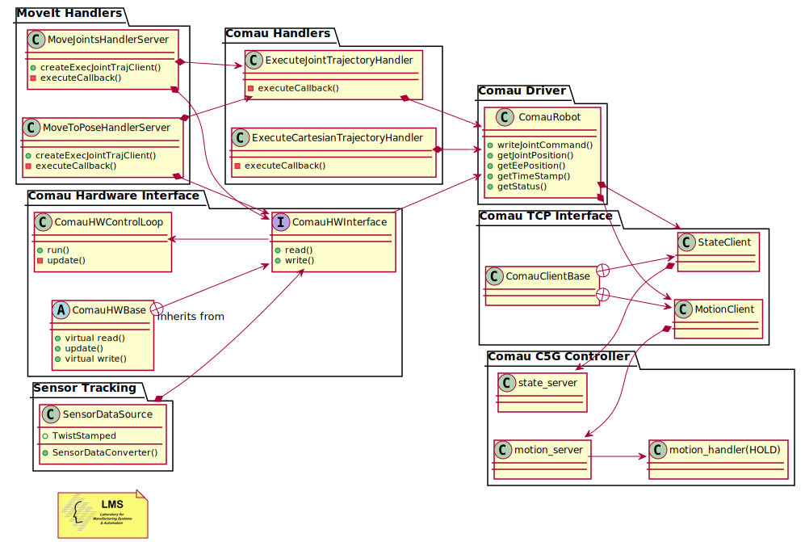

#comau_driver 

The comau_driver package

# comau_action_handlers

The comau_action_handlers component diagram

<!---->

# How to control a real robot 

**ATTENTION!!!**\
Always check the robot surroundings. Make sure that no one is near the robot.

### Robot side

Clone the comau_pdl_ws in the PC that has access to robot's controller FTP.

```bash
git clone https://github.com/LMS-Robotics-VR/comau_pdl_ws.git
```

1. Load `pdl_tcp_functions`. (NO HOLD PDL program with utility functions for the TCP/IP communication)
2. Load `state_server`. (NO HOLD PDL program that contains a TCP server for publishing robot's state)
3. Load `motion_server`. (NO HOLD PDL program that contains a TCP server for receiving motion commands)
4. Load `motion_handler`. (HOLD PDL program that executes the motion commands)

### PC side

### Configuration

At comau_driver/config/controllers.yaml we need to tell the hardware interface to not use the motion client. 

P.S For sending asynchronous trajectories the use_motion_server parameter needs to be false since the action servers use the motion client and not the hardware interface 

```bash
# Settings for ros_control hardware interface
comau_hardware_interface:
   use_state_server: true
   use_motion_server: false
   joints: &robot_joints
     - joint_1
     - joint_2
     - joint_3
     - joint_4
     - joint_5
     - joint_6
```

### Starting Sequence

1. Ensure that you have connection with the robot or RoboShop.
2. Once the ROS workspace is built (see instructions in main [README](../README.md)), you are good to go ahead starting the driver with the following commands in different terminals.

```bash
# To start the comau driver
roslaunch comau_bringup <robot_model>_bringup.launch \
  robot_net_config_file:=<robot_net_config_file>

# To start MoveIt move_group
roslaunch comau_moveit_interface <robot_model>_moveit.launch

# To view the robot in RViz
roslaunch comau_viz rviz.launch config:=moveit

# To start all action servers
roslaunch comau_action_handlers main_comau_action_handlers.launch
```

For the parameter `robot_model` use one of the following: *racer5-0-80, racer5-cobot, racer7-14, nj4-110, nj220, aura, aura-mimic*.

`robot_net_config_file` parameter shows the filename of the network configuration. This file must be stored in comau_driver/config folder. By default is used the roboshop_net_config.yaml file, which contains the parameters for using the driver with a virtual robot in Roboshop. If you want to connect with different network configuration (e.g Robot ip), create a new .yaml file following the format of roboshop_net_config.yaml.

## Send a trajectory execution command

Start the `motion_handler` PDL program.

Now you are ready to send a trajectory from an ROS action client to execute joint / cartesian trajectory  action server. You may find the definition of this ROS action at `comau_msgs` package.

For simple tests you can use the test [GUI action client](https://github.com/ros/actionlib/tree/noetic-devel/actionlib_tools) with the following command:

```bash
rosrun actionlib axclient.py /execute_joint_trajectory_handler
rosrun actionlib axclient.py /execute_cartesian_trajectory_handler
```
### Joint trajectory

At the *Goal* area of the window you should place a trajectory of multiple joint positions. For valid goals, you should follow the format of the example bellow :

```yaml
trajectory: [
positions: [0.436332, 0.0, -1.5708, 0.0, 0.0, 0.0],
positions: [0.872665, 0.0, -1.5708, 0.0, 0.0, 0.0],
positions: [1.22173, 0.0, -1.5708, 0.0, 0.0, 0.0],
#
# other joint positions with angles in rad
#
positions: [0.872665, 0.0, -1.0472, 0.0, 0.0, 0.0]
]
```

### Cartesian trajectory

At the *Goal* area of the window you should place a trajectory of multiple cartesian poses. For valid goals, you should follow the format of the example bellow :

```yaml
trajectory: [
# relative to tool frame 
{frame: tool_controller, x: 0.0, y: 0.0, z: 0.1, roll: 0.0, pitch: 0.0, yaw: 0.0},
# relative to base link
{frame: base_link, x: 0.9339, y: 0.0, z: 1.1506, roll: 0.0, pitch: 1.5707, yaw: 0.0},
#
# other cartesian poses with angles in rad
#
{frame: base_link, x: 0.9339, y: 0.0, z: 1.1506, roll: 0.0, pitch: 1.5707, yaw: 0.0}
]
```

When you click send goal the robot should start to move along the trajectory that you have send.

**ATTENTION!!!**\
Always check the robot surroundings. Make sure that no one is near the robot.

## Use MoveIt with Comau robots
Currently there are 2 Action Servers implement for interfacing Comau Robots with MoveIt

1. **MoveToPose** : This Action Server takes as a goal a target position for the robot to go to. **It is important to note** that this target position doesn't need to be relative to the "base_link" but can be relative to any frame like "end effector" or "target object"

2. **MoveJoints** : This Action Server takes as a goal desired joint position for the robot to go to.

**On the Goal definition of these Action Servers there is a bool argument send_trajectory that if set to true will do the MoveIt planning and send the calculated trajectory as a goal to the execute_joint_trajectory_handler Action server for execution on the real robot or on the Roboshop**

**If this parameter is set to false will execute the trajectory dynamically - currently implemented only on simulation.**

*See on the comau_moveit_interface package on how to send Goals to MoveIt with Python scripts or C++.*


<!---->


