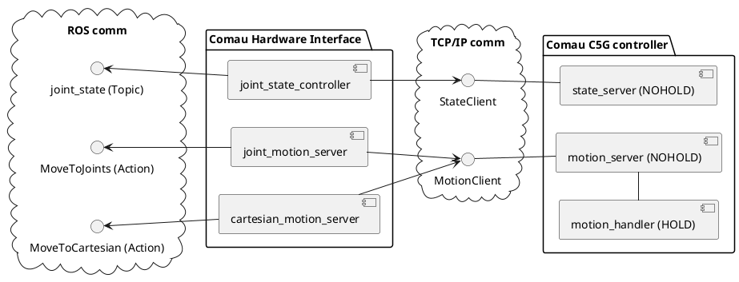
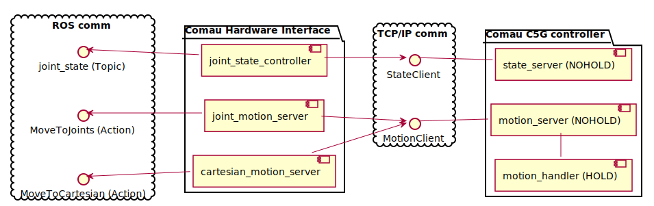

#comau_tcp_interface

The comau_tcp_interface package

<!-- TODO Update the diagram -->

```plantuml
@startuml component_diagram
skinparam componentStyle uml2
skinparam defaultTextAlignment center

left to right direction

package "Comau Hardware Interface " {
    [joint_state_controller]
    [joint_motion_server]
    [cartesian_motion_server]
    ' [admittance_control_server] #Gold
}

package "Comau C5G controller"{
    [state_server (NOHOLD) ]
    [motion_server (NOHOLD)] -left- [motion_handler (HOLD) ]
    ' [admittance_control_server (NOHOLD)] #Gold
    ' [admittance_control_handler (HOLD) ] #GOld
    ' [admittance_control_server (NOHOLD)] -left- [admittance_control_handler (HOLD) ]
}

cloud "TCP/IP comm"{
[state_server (NOHOLD) ] -up-  StateClient
[joint_state_controller] -down-> StateClient


[motion_server (NOHOLD)] -up- MotionClient
[joint_motion_server] -down-> MotionClient
[cartesian_motion_server] -down-> MotionClient

' () AdmittanceControlClient #Gold
' [admittance_control_server (NOHOLD)] -up- AdmittanceControlClient
' [admittance_control_server] -down-> AdmittanceControlClient

}
cloud "ROS comm"{
() "joint_state (Topic)" as joint_state
[joint_state_controller] -up-> joint_state

' () "AdmittanceControl (Action)" as AdmittanceControlAction #Gold
' [admittance_control_server] -up-> AdmittanceControlAction

() "MoveToJoints (Action)" as movej
() "MoveToCartesian (Action)" as movec
[joint_motion_server] -up-> movej
[cartesian_motion_server] -up-> movec
}
@enduml
```

