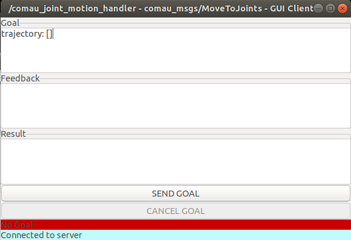

# Comau Experimental

## Overview

This repository contains all the required ROS packages to work with Comau robots through ROS.

The Comau Experimental package has been tested under ROS Melodic and Ubuntu 18.04. This is research code, expect that it changes often and any fitness for a particular purpose is disclaimed.

## Installation

### Building from Source

#### Requirements

- [Robot Operating System (ROS)](http://wiki.ros.org) (middleware for robotics)

It is recommended to use **Ubuntu 18.04 with ROS melodic**, however using Ubuntu 16.04 with ROS kinetic should also work.

#### Building procedure

```bash
# source global ros
source /opt/ros/<your_ros_version>/setup.bas

# create a catkin workspace
mkdir -p catkin_ws/src && cd catkin_ws

# Checkout the latest version of this repository into your catkin workspace *src* folder.
svn checkout \
  https://syrios.mech.upatras.gr/svn/comau_ros/comau_experimental src/

# Install dependencies of all packages.
sudo apt update -qq
rosdep update
rosdep install --from-paths src --ignore-src -r -y

# build the workspace
catkin_make

# activate the workspace
source devel/setup.bash

```

## How to use the driver only for monitoring a robot

Comau driver in this case is used to get information from the robot.

### Robot side

1. Load `pdl_tcp_functions`. (NO HOLD PDL program with utility functions for the TCP/IP communication)
2. Load `state_server`. (NO HOLD PDL program that contains a TCP server for publishing robot's state)

### PC side

1. Ensure that you have connection with the robot.
2. Once the driver is built you are good to go ahead starting the driver.

  ```bash
    roslaunch comau_driver <robot_model>_bringup.launch \
      robot_net_config_file:=<robot_net_config_file>
  ```

  For the parameter `robot_model` use one of the following: *racer5-0-80, racer5-cobot, racer7-14, nj4-110, nj220, aura*.

  `robot_net_config_file` parameter shows the filename of the network configuration. This file must be stored in comau_driver/config folder. By default is used the roboshop_net_config.yaml file, which contains the parameters for using the driver with a virtual robot in Roboshop. If you want to connect with different robot, create a new .yaml file following the format of roboshop_net_config.yaml.

3. Open `rviz` to view the robot state

```bash
roslaunch comau_viz rviz.launch config:=view_robot
  
# Alternative way to launch rviz
rosrun rviz rviz -d `rospack find comau_viz`/rviz/view_robot.rviz

```

## How to use the driver to send joint commands

**ATTENTION!!!**\
Always check the robot surroundings. Make sure that no one is near the robot.

### Initialize the driver

#### Robot side

1. Load `pdl_tcp_functions`. (NO HOLD PDL program with utility functions for the TCP/IP communication)
2. Load `state_server`. (NO HOLD PDL program that contains a TCP server for publishing robot's state)
(If you haven't already...)
3. Load `motion_server`. (NO HOLD PDL program that contains a TCP server for receiving motion commands)
4. Load `motion_handler`. (HOLD PDL program that executes the motion commands)

#### PC side

1. Ensure that you have connection with the robot or RoboShop.
2. Once the driver is built you are good to go ahead starting the driver with the following command:

```bash
roslaunch comau_driver <robot_model>_bringup.launch \
  robot_net_config_file:=<robot_net_config_file>
```

For the parameter `robot_model` use one of the following: *racer5-0-80, racer5-cobot, racer7-14, nj4-110, nj220*.

`robot_net_config_file` parameter shows the filename of the network configuration. This file must be stored in comau_driver/config folder. By default is used the roboshop_net_config.yaml file, which contains the parameters for using the driver with a virtual robot in Roboshop. If you want to connect with different robot, create a new .yaml file following the format of roboshop_net_config.yaml.

> Note:\
> In order to be sure that you have launch everything correctly, run in a terminal the following command:
>
>```bash
>rostopic list | grep comau_joint_motion_handler
>```
>
>You should have this output
>
>```bash
>/comau_joint_motion_handler/cancel
>/comau_joint_motion_handler/feedback
>/comau_joint_motion_handler/goal
>/comau_joint_motion_handler/result
>/comau_joint_motion_handler/status
>```

### Send a joint trajectory for execution

Start the `motion_handler` PDL program.

Now you are ready to send a trajectory from an ROS action client to comau joint motion action server. You may find the definition of this ROS action at `comau_msgs` package.

For simple tests you can use the test [GUI action client](https://github.com/ros/actionlib/tree/noetic-devel/actionlib_tools) with the following command:

```bash
rosrun actionlib axclient.py /comau_joint_motion_handler
```


At the *Goal* area you should place a trajectory of multiple joint positions. For valid goals, you should follow the format of the example bellow :

```yaml
trajectory: [
positions: [0.436332, 0.0, -1.5708, 0.0, 0.0, 0.0],
positions: [0.872665, 0.0, -1.5708, 0.0, 0.0, 0.0],
positions: [1.22173, 0.0, -1.5708, 0.0, 0.0, 0.0],
#
# other joint positions with angles in rad
#
positions: [0.872665, 0.0, -1.0472, 0.0, 0.0, 0.0]
]
```

When you click send goal the robot should start to move along the trajectory that you have send.

### Send a cartesian trajectory for execution

*- Work in progress*

## How to use MoveIt with Comau Robots

### Simulation with Gazebo

```bash
# To launch the Gazebo simulation + ros controllers
roslaunch comau_sim <robot_model>.launch
  
# To start move_group
roslaunch comau_moveit_interface moveit.launch robot:=<robot_model>

# To view the robot in RViz and e.g send random valid goals
roslaunch comau_viz rviz.launch config:=moveit
```

For the parameter `robot_model` use one of the following: *racer5-0-80, racer5-cobot, racer7-14, nj4-110, nj220, aura*. \
See on the comau_moveit_interface package on how to send Goals to MoveIt with Python scripts or C++.

### Real robot

*- Work in progress*
